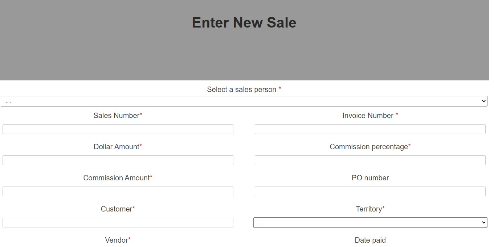
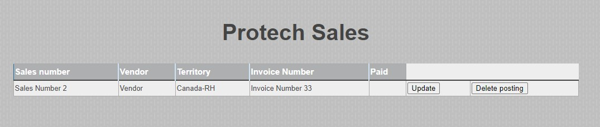

# Protech-api
A backend express api server app to the Protech-app

## summary 

API server that manages sales data for the front end app (Protect-app)

## Live front end app

[Protech](https://protech-app.vercel.app/collection).

## Front Repo
[Git](https://github.com/dadetifa1/Protech-app).

## Screen Shots
Capture a sale:

Sales collection(s):

## Tech used 
NodeJS - Express - postgres - Git - Relationship DB

## API documentation

**Get all**

 **URL**

  /api/postings

* **Method:**
  
  `GET`
* **Header:**

  Authorization
  
* **Success Response:**
  
  * **Code:** 200  
    **Content:** `[
        {
            "id": 1,
            "sales_number": "Sales Number",
            "invoice": "Invoice Number",
            "dollar_amount": "$23.00",
            "commission_percentage_fraction": "0.0900",
            "commission_amount": 24,
            "po_number": "PO number 243",
            "customer": "Customer 23",
            "territory": "Canada-RH",
            "vendor": "Vendor",
            "date_paid": null,
            "paid": false,
            "first_name": "John",
            "last_name": "Doe",
            "sales_person_id": 1
        }
    ]`
 
* **Error Response:**
  

  * **Code:** 401 UNAUTHORIZED  
    **Content:** `{ error : "Unauthorized request" }`
  

**Get a specific posting**

 **URL**

  /api/postings/:id

* **Method:**
  
  `GET`
* **Header:**

  Authorization
  
* **Success Response:**
  
  * **Code:** 200  
    **Content:** ` {
            "id": 1,
            "sales_number": "Sales Number",
            "invoice": "Invoice Number",
            "dollar_amount": "$23.00",
            "commission_percentage_fraction": "0.0900",
            "commission_amount": 24,
            "po_number": "PO number 243",
            "customer": "Customer 23",
            "territory": "Canada-RH",
            "vendor": "Vendor",
            "date_paid": null,
            "paid": false,
            "first_name": "John",
            "last_name": "Doe",
            "sales_person_id": 1
        }`
 
* **Error Response:**
  

  * **Code:** 401 UNAUTHORIZED  
    **Content:** `{ error : "Unauthorized request" }`
    
 
**Delete a specific posting**

 **URL**

  /api/postings/:id

* **Method:**
  
  `DELETE`
  
* **Header:**

  Authorization
  
* **Success Response:**
  
  * **Code:** 204  
     
* **Error Response:**
  

  * **Code:** 401 UNAUTHORIZED  
    **Content:** `{ error : "Unauthorized request" }`
  

